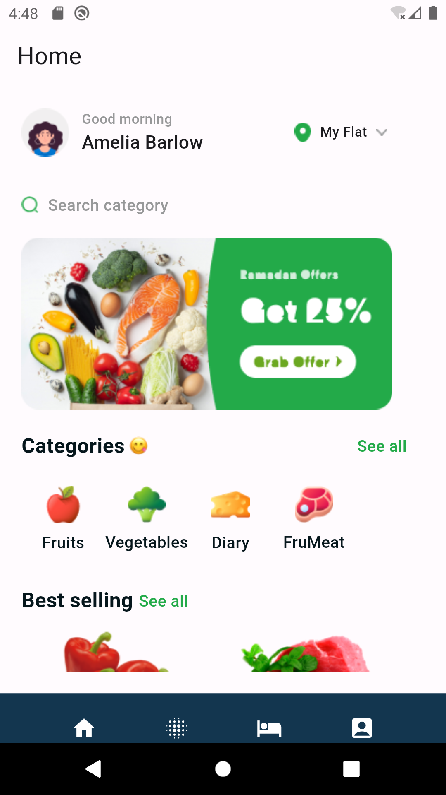

# Class 11 Assignment - Flutter Batch2 Task - Figma to Flutter Code 

This is an assignment for 'flutter batch2 - influxdev'. Flutter project. 

## Instruction:
<ul>  
    <li>1. flutter clean</li>
    <li>2. flutter pub get</li>
    <li>3. flutter run</li>
</ul>

### Requires Android:

Minimum SDK Version: 21 (Android 5.0 or, Lollipop) and Target SDK Version: 34 (Android 14)

### Tested On:

- Emulator Pixel 2 API 29

### Used Tools:

Flutter 3.13.2. 

### Developed by:

Md. Rezwan Saki Alin
https://www.alinsworld.com/

## License

Flutter is an open source framework by Google.

